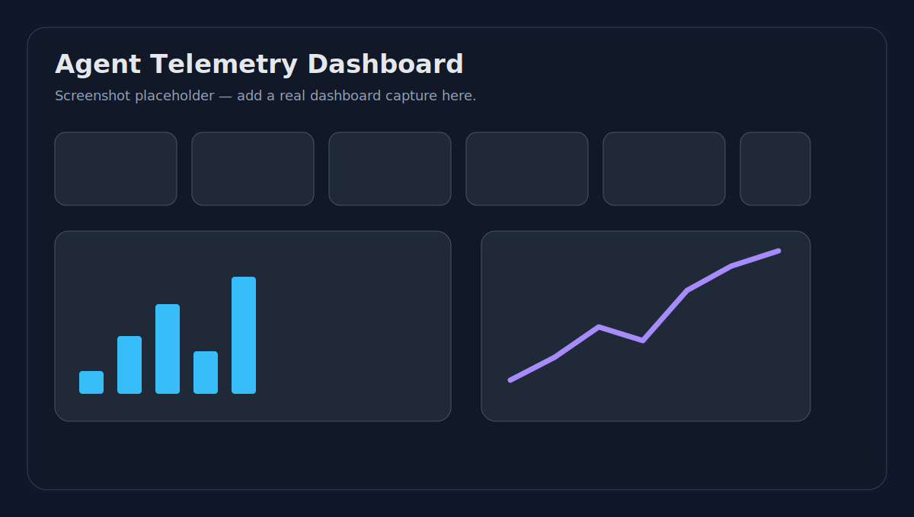

# Agent Telemetry Dashboard

A polished, lightweight Streamlit dashboard for inspecting telemetry from memory-enabled and tool-using AI agents.

It helps answer the questions agent builders ask after a run: **What tools were called? Did memory help or drift? Where did failures and retries happen? How confident was the agent over time?**



## Problem statement

Modern AI agents do not just generate text. They read and write memory, call tools, retry failed actions, branch across tasks, and accumulate drift over time. Without telemetry, debugging those systems becomes guesswork.

This repository provides a simple local dashboard and deterministic metrics layer for exploring agent run data without external services or LLM API calls.

## Why agent telemetry matters

Agent telemetry makes behavior observable:

- **Memory operations** reveal whether an agent is relying on context or over-writing state.
- **Tool call traces** show operational complexity and possible cost drivers.
- **Failure and retry metrics** expose brittle workflows.
- **Confidence distributions** help spot low-certainty tasks before they reach users.
- **Drift scores** make long-running agent behavior easier to monitor.
- **Timelines** turn scattered events into a run-level story.

## Features

- Streamlit dashboard using local sample data
- Pydantic models for typed telemetry validation
- JSON and CSV telemetry loading utilities
- Deterministic Pandas metrics
- Plotly charts for:
  - Tool calls per run
  - Memory reads/writes over time
  - Failure rate
  - Confidence distribution
  - Drift score over time
  - Retry count per task
- Run timeline view
- Filters for agent name, run status, and date range
- Pytest coverage for loading and metrics
- GitHub Actions CI

## Quickstart

```bash
git clone https://github.com/<your-username>/agent-telemetry-dashboard.git
cd agent-telemetry-dashboard
python -m venv .venv
source .venv/bin/activate
pip install -e .[dev]
streamlit run app/streamlit_app.py
```

Run tests:

```bash
pytest
```

Run linting:

```bash
ruff check .
```

For Streamlit Community Cloud or simple deployments:

```bash
pip install -r requirements.txt
streamlit run app/streamlit_app.py
```

## Telemetry schema

Sample records live in [`data/sample_telemetry.json`](data/sample_telemetry.json) and [`data/sample_telemetry.csv`](data/sample_telemetry.csv).

Each record includes:

- `run_id`
- `agent_name`
- `task_name`
- `timestamp`
- `status`
- `memory_reads`
- `memory_writes`
- `tool_calls`
- `failures`
- `retries`
- `confidence`
- `drift_score`
- `latency_ms`
- `notes`

See [`docs/telemetry_schema.md`](docs/telemetry_schema.md) for details.

## Example use cases

- Portfolio project demonstrating practical AI observability skills
- Local dashboard for inspecting prototype agent runs
- Evaluation aid for memory-agent experiments
- Starter schema for tool-use telemetry
- Teaching example for Streamlit + Pandas + Plotly dashboards

## Roadmap

- Add exportable run reports
- Add session-level grouping across multiple runs
- Add anomaly markers for sudden drift or retry spikes
- Add optional SQLite ingestion
- Add screenshot assets and demo video
- Add richer timeline traces for individual tool calls

## No external services

This project intentionally uses local data only. It does not call LLM APIs, telemetry vendors, or hosted databases.

## License

MIT
